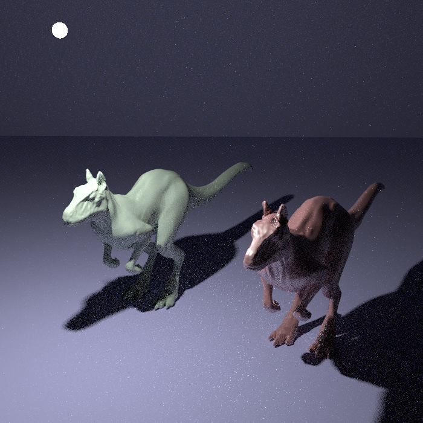
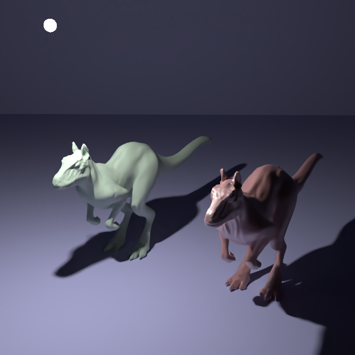
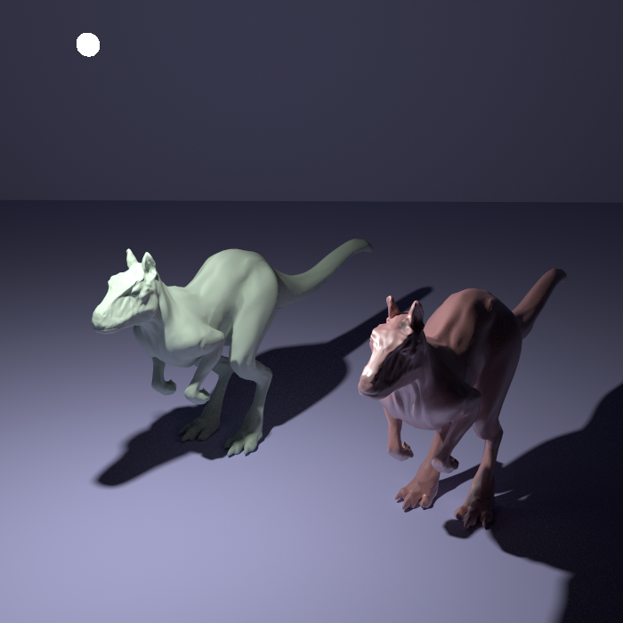
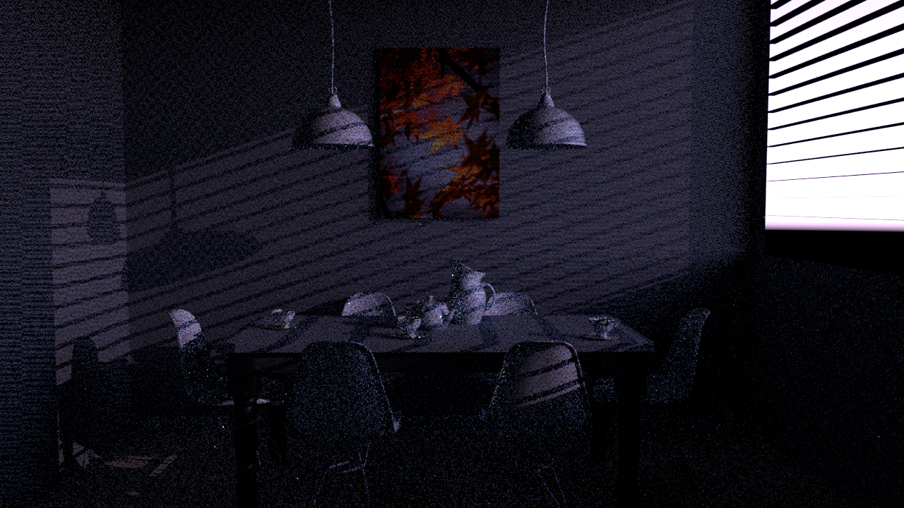
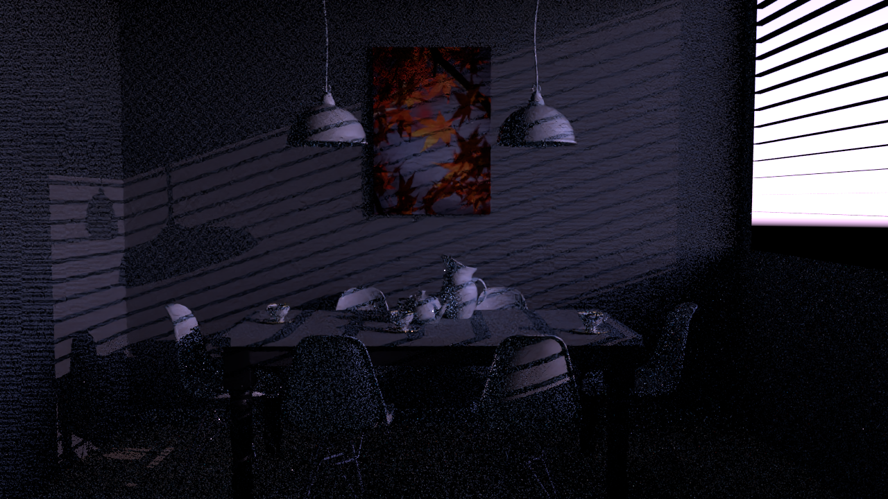

pbrt + oidn, Version 1.0
=========================

Build PBRT with README from their github: [pbrt-v3](https://github.com/mmp/pbrt-v3/)

Once you gain familiarity with pbrt's build process,
Gain a copy of [Intel Threading Building Blocks](https://www.threadingbuildingblocks.org/) (TBB) 2017 or later. Follow the install on OIDN Github: [oidn](https://github.com/OpenImageDenoise/oidn) see prerequisites.

### Running ###

OIDN is added as a command line argument, e.g.

```bash
$ ./build/pbrt --denoise scenes/killeroo-simple.pbrt
```

Usage has also been added to pbrt --help:

```
$ ./build/pbrt --help
```

Examples
========

### Killeroo ###

- 8 Samples Per Pixel



- Denoised



- Reference (1024 Samples Per Pixel)



### Dining Room ###

- 8 Samples Per Pixel (PBRT_SAMPLED_SPECTRUM=true)



- 8spp Denoised (PBRT_SAMPLED_SPECTRUM=true)



- 64 Samples Per Pixel (PBRT_SAMPLED_SPECTRUM=true)


- 64spp Denoised (PBRT_SAMPLED_SPECTRUM=true)


- Reference (1024 Samples Per Pixel, PBRT_SAMPLED_SPECTRUM=true)


Notes
=====

- At present Intel Threading Building Blocks is only supported through preinstall. Support for building from source is possible, but not implemented at this time. No intention of adding support. My CMake at present is not strong enough.

- Denoising is added as a feature of the Film class. From an object-oriented point of view, it makes more logical sense for denoising to be a feature of the camera (class) rather than the film (class). Implementation within Film class was much easier. Addition of denoising to camera class would have required substantive architectural changes.

- Intel Open Image Denoiser supports denoising on beauty images alone, it also supports increased fidelity by providing additional beauty details. OIDN accepts beauty image alone, and beauty image with both a normal and albedo image. The possibility exists to extend the implementation to dump albedo and normal from pbrt. This change would be nontrivial, and I have been unable to investigate the denoising improvements from albedo and normal. This is potentially an interesting avenue of further study.
